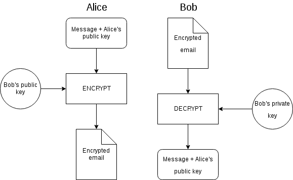
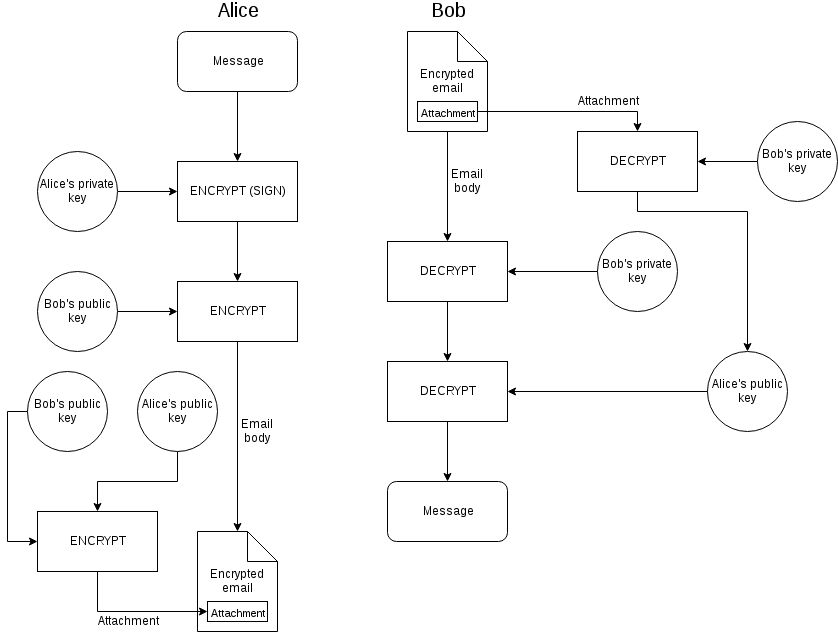
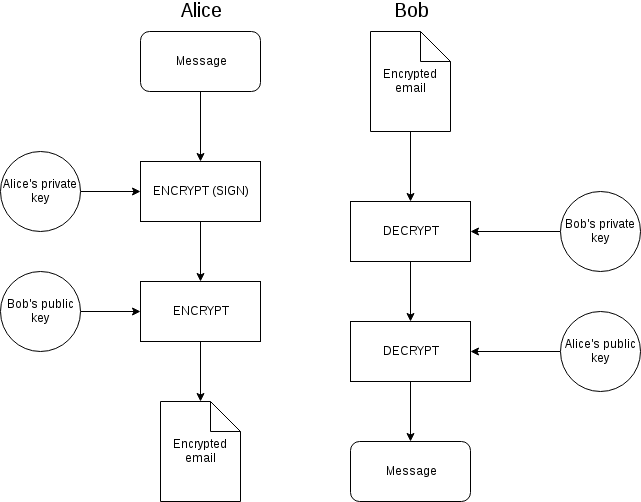

## What is PGP

PGP stands for Pretty Good Privacy. It's an encryption program that's mainly used for email encryption, but it can be used for encrypting any sort of data.

### Terminology

PGP is the program that was initially released in 1991 by Phil Zimmermann.

OpenPGP is the standard (anyone can create their own encryption program that follows this standard).

There are many programs following the standard, most commonly used one being GPG (GNU Privacy Guard).

Note: PGP usually refers to the standard -- OpenPGP, not the program.

## How does PGP work

PGP utilizes [public key cryptography](glossary.html#publickeycrypto), so both the sender and the receiver have their [public](glossary.html#publickey) and [private](glossary.html#privatekey) keys.

Public keys are public because you can distribute them freely without hurting the security of your keys.

Private keys are private because you should protect them very well. PGP encrypts your private key with a passphrase, so if it accidentally gets leaked, your communications aren't necessarily compromised, but it's still a good idea to generate a new [key pair](glossary.html#keypair) in case of a leak.

It's also important to differentiate between encryption and authentication. This is why PGP supports *signing* as well.

### Difference between encryption and authentication

Your private key may be secure, but your email is not. Attackers can try to make it look like an email came from you, or even send it from your address -- someone can\* access your computer, **your email provider can send emails from your address extremely easily**, etc. And because public keys are usually publicly available, without authentication it's extremely easy to supply someone with fake information.

*Bob receives an encrypted email from alice@example.com. The email came from Alice's email address, should Bob trust it?* No. It needs to be **signed** (see below) by Alice.

\* this obviously depends on how secure your computer is -- e.g. if you use [full-disk encryption](glossary.html#fde), an email client that remembers your password, etc.


### Encrypting messages

Alice wants to send an encrypted email to Bob. She downloads his public key and verifies it (*verification* is explained further in the tutorial).

Then she encrypts the message **and *her* public key** with Bob's public key and sends it to Bob (she needs to send Bob her public key as well, but simply attaching it in plaintext to the email is a bad idea, as an attacker can replace it, thus give Bob the wrong key -- the attacker's key -- and decrypt Bob's subsequent reply).

The attachment is separate from the email body -- it's is not encrypted, so replacing it is extremely simple. But Alice can send her public key to Bob in the email's body, **as well as in attachment** -- the important thing is that it's encrypted, right?

Actually, no. <mark>Since the message is not signed by Alice, she shouldn't send her public key in attachment, encrypted or not.</mark> Eve (an adversary) could encrypt her public key with Bob's public key and **replace the attachment.**


<span class="caption">**Figure 1** -- a diagram showing initial contact over PGP (unsigned)</span>

Also note that this is an example of an initial contact between Alice and Bob. Otherwise Alice would have no need to send her public key to Bob.

### Encrypting and signing messages

Same as the previous example, but before encrypting the message with Bob's public key, Alice encrypts it with her **private key**. This process is called **signing**. <mark>This is the right way to use PGP.</mark> 

How does it work? After Bob decrypts Alice's email with his private key, he gets the **message *encrypted* with Alice's *private* key**. In public key cryptography, the public and private keys are a *pair of keys* -- a **keypair**. What's encrypted with the public key can be decrypted with the private key, and what's encrypted with the private key can be decrypted with the public key. <mark>Decrypting a signed message with the sender's public key decrypts the message to its unsigned (plaintext) version.</mark>



<span class="caption">**Figure 2** -- a diagram showing initial contact over PGP (signed)</span>

Since the email body is signed (encrypted) with the sender's private key and the receiver doesn't know the sender's public key, it needs to be sent separately, outside the email body -- in attachment.

### How do keys and encrypted data look like?

PGP keys look like this:

```
-----BEGIN PGP PUBLIC KEY BLOCK-----
Version: GnuPG v1

mQINBFkjJJUBEACh2gA/MTh8NXyK8aPZ3+Bx/zKhES1aaQsohTyghSprelfwZwFO
AyA4XxWVbI8EiSACXsE2EHO2b9WILQtF5EofNWuVmvdOLcCFg9UAp31nBGZtoiml
HJ2iLEDlp/nQl5WJz3U2Ikl2bPrZ0covdgPXMZXBbLqMbkTYWhub1gv93YKhRvCc

[... the key is much longer ...]

iXgZkxP+FdXa3CDon+75H6+IHE0SqpiSjfHpiuwFlxhX+UVuGd6tebfWSP2qtTSL
1PijypjlKdW63l0n
=AUDE
-----END PGP PUBLIC KEY BLOCK-----
```

Notice the `PGP PUBLIC KEY BLOCK` -- this is a public key.
A private key would have `PGP PRIVATE KEY BLOCK` instead of that. An encrypted file/message would have `PGP MESSAGE`.

Note that this near-human-readable output is present when using the *ASCII* mode (*ASCII* means *American Standard Code for Information Interchange*, which basically means that it will only contain letters you'd find on an American keyboard). The non-ASCII mode would be just a bunch of random-looking bytes, so most of it couldn't be even displayed.

#### Revocation certificates

Once you generate your keypair, you should generate a revocation certificate as well. In case your private key gets leaked you just upload the revocation certificate to a keyserver and it will show that the key has been revoked next to the key info.

### Keyservers

How to distribute public keys, though? Well, that's what keyservers are for. Anyone can upload public keys to them. Their key functionality is *synchronizing* -- uploading your public key to only one is enough, it'll share it with all the other keyservers.

One of the most commonly used ones is the [MIT keyserver](https://pgp.mit.edu).

Note that anyone can generate (and distribute) keys for any name and email address, so grabbing the first key you see is not a good idea. This issue is discussed in the following section.

## Using PGP

### Exchanging keys

Both diagrams (Figure 1 and 2) showed how PGP is used for the *initial* (first) contact, meaning Alice had Bob's public key (which is publicly available), but Bob didn't have hers. She needed to share her public key with Bob, so she had to securely send it to Bob along with the message.

Therefore, Bob can securely receive Alice's key, but how can Alice know she really has Bob's key? 

One of the ways this is solved is that Bob's key is signed by other parties, ideally ones that both Alice and Bob trust. Key servers show when a key has been signed by another key.

### Fingerprints

Although it's not always possible, the best way is to exchange keys in advance of the communication. Since keys are very big and impractical to exchange in full length, PGP keys have their **fingerprints**. They're basically a short version of the key. The fingerprint of [this](https://theprivacyguide.org/other/pgp_key.txt) key is `AE9B418A72B2D4A73BEAF40290BD83DE4412E912` (note: there's also `Key-ID`, which is even shorter, but obviously much less secure. <mark>Use fingerprints, not Key-IDs.</mark>)

In addition to this, you need to know which key to use, as other people can upload keys with the same name and email address to keyservers. Hosting the key on a personal website, or adding the fingerprint to Twitter bio is useful.

A fingerprint is all you need to download the key from a keyserver.

### PGP workflow

Once keys are exchanged, either in advance of the communication, or by attaching the public key in an encrypted form to the email (as you can see in Figure 2 -- the diagram above), the process is exactly the same as with the initial contact, minus the parts with attachment, as there's no need to exchange keys anymore.



<span class="caption">**Figure 3** -- a diagram showing communication over PGP (signed)</span>